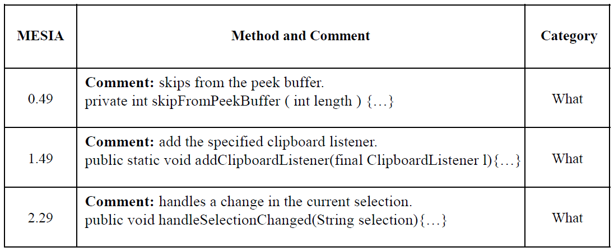
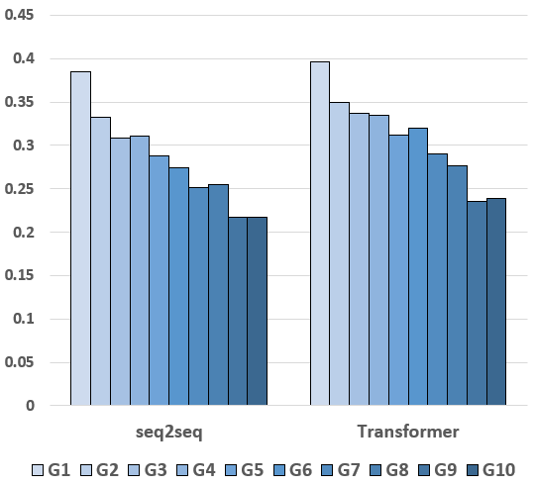
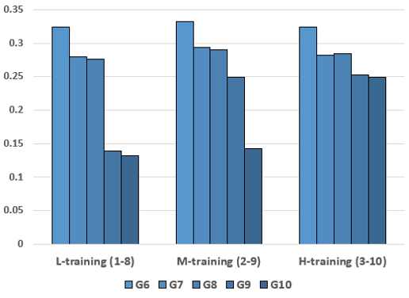

# MESIA: Understanding and Leveraging Supplementary Nature of Method-level Comments for Automatic Comment Generation

## Introduction
Code comments are important for developers in program comprehension. In scenarios of comprehending and reusing a method, developers expect code comments to provide supplementary information beyond the method signature. However, the extent of such supplementary information varies a lot in different code comments. We raise the awareness of the supplementary nature of method-level comments in this paper.

 

## MESIA
  As the first attempt to quantify the extent of supplementary information that a code comment can provide beyond the method signature, we propose a new metric named MESIA.
  
  In 1948, Shannon derived a metric of information content named the self-information of a message x: $$I(x) = -log(p(x))$$ 
  Here $p(x)$ is the probability that message x is chosen from all possible choices in the message space X. The self-information can be interpreted as quantifying the surprise level of a particular outcome. When a message with less appearing possibility occurs, it brings more information.
  
  We define a code comment in a dataset as $C=\lbrace w_{1},w_{2},...,w_{n} \rbrace$. All code comments in the  dataset are defined as $Comments=\lbrace C_{1},C_{2},...,C_{m}\rbrace$. All words used in comments of the dataset are defined as $W = \bigcup\limits_{i=1}^m \lbrace w|w \in C_{i}\rbrace$. We use the frequency of each word $x$ (referred to as $freq(x)$ ) in $W$ to calculate the possibility for each word $w$ in the given code comment. 
$$p(w|W) = freq(w)/\sum_{x\in W}^{}(freq(x))$$

We then define the information amount of a comment C in the dataset as 
$$I(C|W) = -\sum_{w \in C}log(p(w|W))$$

we define the supplementary information amount of a comment C beyond its method signature as
$$I(C|Code,W) = -\sum_{w \in C}log(p(w|Code,W))$$

Here the $Code$ in the formula refers to the words in the method's split signature. We consider the method signature in the metric as presented in the following formulas

$$
p(w|Code,W)= 
\begin{cases} 
1 & w \in Code\\ 
p(w|W)  & w \notin Code 
\end{cases}
$$

Finally, we define the MESIA (**Me**an **S**upplementary **I**nformation **A**mount) of a comment C as 

$$ MESIA(C)=I(C|Code,W)/len(C) =-\sum_{w \in C}log(p(w|Code,W))/len(C)$$

## Research Questions
- **RQ1. How well does MESIA reflect the relative extent of supplementary information in different code comments?**

Answering this research question helps investigate whether MESIA is consistent with manual assessment on the relative supplementary extent of code comments. We also want to find out the distribution of various kinds of code comments in different value ranges of MESIA to better understand the supplementary nature of method-level comments
- **RQ2. What is the capability of existing neural approaches to generate code comments with different MESIA values?**

Answering this research question helps investigate the capability of existing neural approaches to generate code comments with various extents of supplementary information.
- **RQ3. How well can MESIA be used to improve existing neural approaches to generate larger-MESIA comments?**

Answering this research question helps investigate whether the capability of the existing neural approaches can be improved to generate larger-MESIA comments after we use MESIA to improve the training data.

## Evaluation Setup

#### DataSet (TL_CodeSum)
|     | #Training  | #Validation  |#Test  |
| :----:  | :----:  |:----:  |:----:  |
| Original  | 69708 |8714 |8714 |
| Denoised  | 53597 | 7562 |7584 |
| Deduplicated  | 53506 | 6040 |5905 |

#### Neural Approaches
- Seq2seq (CodeNN)
- Transformer (NCS)

## RQ1 Result
            

  
 

### Summary for RQ1:
  **Existing dataset is a mixture of code comments with various extent of supplementary information, and larger-MESIA comments can provide various kinds of useful information about methods. MESIA is consistent with manual assessment of the relative supplementary extent of code comments.**
  
## RQ2 Result

 

### Summary for RQ2:
  **Existing neural approaches are more capable of generating smaller-MESIA comments in the dataset. The generation of larger-MESIA comments has a lot of room for improvement.**
  
## RQ3 Result

  

  

### Summary for RQ3:
  **We can improve existing neural model’s capability to generate larger-MESIA comments by reducing the proportion of smaller-MESIA comments in the training set. However, the generation of larger-MESIA comments still has a long way to go.**
