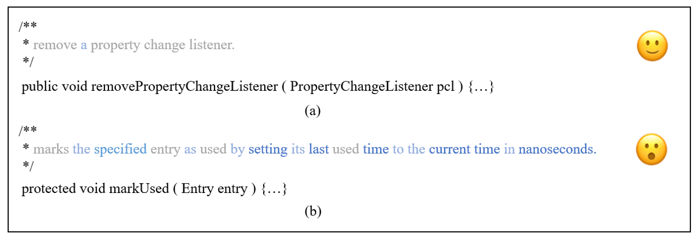

# MESIA: Toward Generating Supplementary Code Comments

Code comments are important for developers in program understanding. In scenarios of understanding and reusing an API method, developers expect code comments to provide more supplementary information beyond the API method's signature. However, the extent of such supplementary information varies a lot in different code comments. 

# Motivating Example

Different code comments can provide different extent of supplementary information!

